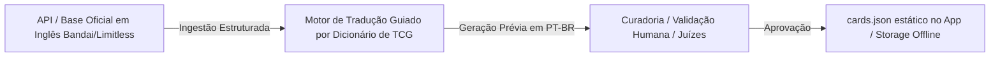
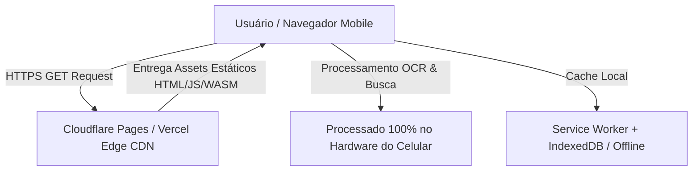

# Arquitetura e Plano de Implementação: "Haki da Leitura" (Scanner & Tradutor de OPTCG)

Documento de arquitetura, modelagem de dados, ambiente containerizado com Docker, infraestrutura de hospedagem e plano de execução passo a passo do **Haki da Leitura** (anteriormente codinome OP-Scan).

---

## 1. Visão Geral do Produto e Arquitetura de Informação

O **Haki da Leitura** é uma aplicação PWA (*Progressive Web App*) Mobile-First containerizada com Docker, projetada para operação ultrarrápida e 100% offline em mesas de jogos e torneios presenciais.

### 1.1 Diagrama de Navegação e Fluxo do Usuário

```mermaid
flowchart TD
    A[Abertura do App] --> B[Visor de Escaneamento Câmera/ROI]
    
    %% Fluxo Principal de Câmera
    B -->|Código Identificado| C[Feedback Tátil/Visual + Congelamento]
    C --> D[Ficha Detalhada da Carta]
    
    %% Fluxo de Fallback / Pesquisa
    B -->|Toque em Buscar / Falha no OCR| E[Tela de Busca Manual Auto-Complete]
    E -->|Seleção da Carta| D
    
    %% Interatividade na Ficha
    D -->|Toque em Keyword ex: [Blocker]| F[Gaveta/Modal de Regra e Timing]
    F -->|Fechar Gaveta| D
    
    %% Funcionalidades Auxiliares
    B -->|Ícone de Livro/Glossário| G[Dicionário Global de Regras]
    G -->|Selecionar Palavra-Chave| F
```

### 1.2 Detalhamento das Telas Principais

1. **Visor de Escaneamento (Tela Inicial Default):**
   - **Interface:** Viewfinder em tela cheia com overlay escuro e moldura retangular destacando a **Região de Interesse (ROI)** no canto inferior da carta (onde o código `OPxx-xxx` fica gravado).
   - **Controles Rápidos:** Alternar Lanterna (Flashlight API), Trocar Câmera (Front/Back), Botão de Acesso Direto à Busca Manual.
   - **Indicador de Status:** Indicador discreto no topo ("Buscando código..." / "Offline - Banco Pronto").

2. **Ficha Detalhada da Carta (Resultado):**
   - **Cabeçalho:** Nome em Português em destaque, Nome em Inglês abaixo, Badge de Código (`OP01-025`), Cor(es) da carta, Custo/Poder/Counter e Tipo (Leader, Character, Event, Stage).
   - **Corpo do Efeito (Texto Dinâmico):** Texto formatado com tags interativas `[On Play]`, `[Blocker]`, `[Rush]`, etc. com destaque de cor diferenciado e área de toque ampla.
   - **Efeito Trigger:** Seção isolada na cor amarela/dourada para gatilhos de vida.
   - **Ações:** Botão "Escanear Outra", "Favoritar/Salvar" e "Ver Regras da Carta".

3. **Gaveta Contextual de Regras (Bottom Sheet / Modal):**
   - Desliza sobre a ficha da carta sem perder a visualização original.
   - **Conteúdo:** Título da Keyword, Tradução Oficial, Explicação Simplificada, Janela de Ativação (Timing) e **Perguntas Frequentes / Pegadinhas de Mesa**.

4. **Busca Manual & Glossário Global:**
   - **Busca:** Input instantâneo com debounce de 150ms filtrando um índice local por código (ex: `OP01-`) ou parte do nome em inglês/português.
   - **Glossário:** Lista alfabética e por categoria de todas as keywords do OPTCG com busca rápida.

---

## 2. Estrutura dos Modelos de Dados

Adotaremos TypeScript para tipagem estrita no projeto, com esquemas otimizados para armazenamento local (IndexedDB via Dexie.js / JSON static cache).

### 2.1 Entidade Carta (`Card`)

```typescript
export type CardType = 'LEADER' | 'CHARACTER' | 'EVENT' | 'STAGE';
export type CardColor = 'RED' | 'GREEN' | 'BLUE' | 'PURPLE' | 'BLACK' | 'YELLOW' | 'MULTI';
export type CardAttribute = 'STRIKE' | 'SLASH' | 'SPECIAL' | 'WISDOM' | 'RANGED';

export interface Card {
  id: string;                    // ex: "OP01-025"
  code: string;                  // Código único oficial ex: "OP01-025"
  namePt: string;                // Nome traduzido ex: "Roronoa Zoro"
  nameEn: string;                // Nome oficial em inglês ex: "Roronoa Zoro"
  cardType: CardType;            // Tipo da carta
  colors: CardColor[];           // Cores (pode ser dupla/multi)
  cost: number | null;           // Custo de DON!! (null para Líderes)
  power: number | null;          // Poder base
  counter: number | null;        // Valor de Counter (+1000, +2000 ou null)
  attribute?: CardAttribute;     // Atributo do personagem
  subtypes: string[];            // Categorias ex: ["Straw Hat Crew", "Supernovas"]
  
  // Textos de Efeito
  effectPt: string;              // Texto do efeito traduzido
  effectEn: string;              // Texto do efeito em inglês
  triggerPt?: string;            // Efeito Trigger em português (se houver)
  triggerEn?: string;            // Efeito Trigger em inglês (se houver)
  
  // Relacionamento com palavras-chave
  keywordIds: string[];          // IDs/slugs de palavras-chave presentes ex: ["on-play", "rush"]
  
  // Metadados da Coleção e Imagem
  setId: string;                 // ex: "OP01"
  setName: string;               // ex: "Romance Dawn"
  imageUrl?: string;             // URL ou caminho do asset local comprimido
}
```

### 2.2 Entidade Palavra-Chave / Regra (`KeywordRule`)

```typescript
export type KeywordCategory = 'TIMING' | 'KEYWORD_EFFECT' | 'COST' | 'RULE';

export interface RuleFaq {
  question: string;              // ex: "Rush: Character pode atacar o Líder adversário?"
  answer: string;                // ex: "Não. Diferente do Rush comum, Rush: Character só pode atacar personagens descansados do oponente no turno em que é jogado."
}

export interface KeywordRule {
  id: string;                    // Slug ex: "rush-character", "on-play"
  rawTag: string;                // Tag textual ex: "[Rush: Character]" ou "[On Play]"
  namePt: string;                // Nome em PT ex: "Investida contra Personagens"
  nameEn: string;                // Nome em EN ex: "Rush: Character"
  category: KeywordCategory;     // Categoria funcional
  summaryPt: string;             // Explicação resumida (1-2 frases)
  fullDescriptionPt: string;     // Explicação detalhada da mecânica
  activationTimingPt: string;    // Em qual fase/janela o efeito ocorre
  faqs: RuleFaq[];               // Casos comuns de dúvida em torneios
}
```

### 2.3 Entidade Resultado de Leitura (`ScanResult`)

```typescript
export interface ScanCandidate {
  code: string;                  // Código candidato ex: "OP01-025"
  confidence: number;            // Índice de confiança de 0 a 1.0
}

export interface ScanResult {
  timestamp: number;             // Timestamp da leitura
  rawTextFound: string;          // Texto bruto capturado pelo OCR
  detectedCode: string | null;   // Código extraído via Regex match
  confidence: number;            // Nível de precisão da leitura
  status: 'SUCCESS' | 'AMBIGUOUS' | 'NOT_FOUND';
  matchedCard?: Card;            // Objeto da carta se encontrado com sucesso
  candidates?: ScanCandidate[];  // Sugestões caso a leitura seja ambígua
}
```

### 2.4 Estratégia de Ingestão e Tradução de Cartas para PT-BR (Pipeline de Dados)

Como a Bandai **não produz cartas físicas impressas em Português**, a tradução adotada pelo OP-Scan segue o padrão consolidado pela comunidade de jogadores e juízes no Brasil.



1. **Ingestão dos Dados Originais (Inglês):**
   - Importação automatizada dos dados estruturados em Inglês (código, nome original, atributo, poder, texto oficial da Bandai) a partir de repositórios/APIs consolidadas de OPTCG (*Limitless TCG* / *OPTCG.db*).

2. **Motor de Tradução Sintática por Dicionário Fixo de TCG:**
   - Mapeamento direto de termos e estruturas repetitivas:
     - Tags: `[On Play]` $\rightarrow$ `[Ao Jogar]`, `[When Attacking]` $\rightarrow$ `[Ao Atacar]`, `[Blocker]` $\rightarrow$ `[Bloqueador]`, `[Activate: Main]` $\rightarrow$ `[Ativação: Principal]`.
     - Fórmulas de Efeito: `Draw 1 card.` $\rightarrow$ `Compre 1 carta.`, `Rest this Character:` $\rightarrow$ `Descanse este Personagem:`.

3. **Curadoria Humana:**
   - Revisão final de cartas com mecânicas inéditas por jogadores/juízes experientes.

---

## 3. Estratégia de OCR Mobile Offline

### 3.1 Padrão do Código OPTCG
- Formatos válidos: `OP01-025`, `ST10-006`, `EB01-003`, `P-001`, `OP07-119`.
- Expressão Regular (Regex) de Validação: `/\b(OP\d{2}|ST\d{2}|EB\d{2}|P)-\d{3}\b/i`.

### 3.2 Estratégia de Recorte ROI e OCR em Web Worker
1. **Recorte no Canvas (ROI Cropping):** Extração apenas dos 15% inferiores da carta (onde fica o código). Reduz o tempo de OCR por frame em até 80%.
2. **Pré-Processamento:** Filtro escala de cinza + binarização de contraste para eliminar reflexos do protetor plástico (sleeve).
3. **Execução Offline:** Tesseract.js rodando em **Web Worker dedicado** (WASM) com whitelist restrita de caracteres (`OPSTEB0123456789-`).
4. **Validação Instantânea:** O texto capturado passa pelo Regex e, ao encontrar o match, dispara vibração haptica (Vibration API) e abre a ficha.

---

## 4. Hospedagem Online Gratuita e Alta Escalabilidade

Para disponibilizar o aplicativo online gratuitamente e garantir que ele suporte picos de múltiplos acessos simultâneos (ex: centenas de jogadores em um torneio regional simultaneamente), adotaremos a seguinte arquitetura:



### 4.1 Escolha da Plataforma: Cloudflare Pages / Vercel (Tier Gratuito Ilimitado)
- **Custo:** R$ 0,00 (Gratuito permanente).
- **Escalabilidade:** Como o **OP-Scan é um PWA 100% Client-Side**, o servidor entrega apenas arquivos estáticos (HTML, JS compilado, CSS e `cards.json`). Todo o processamento pesado de OCR, busca e visualização roda no hardware do celular do usuário.
- **Rede CDN Global:** Resposta em < 30ms em qualquer região do Brasil através da rede Global Anycast da Cloudflare / Vercel Edge Network.
- **Resiliência a Picos:** Capacidade de suportar milhões de requisições por mês sem queda ou cobrança, pois não há servidor backend rodando código dinâmico por requisição.

---

## 5. Estratégia de Testes em Celular Android Conectado à Internet

A API Web de Câmera (`navigator.mediaDevices.getUserMedia`) **exige obrigatoriamente uma origem segura (HTTPS ou localhost)** no Android Chrome.

Para testar a aplicação em um celular Android real durante o desenvolvimento, utilizaremos duas estratégias:

### Método A: Servidor Dev Local com Tunnel HTTPS (Recomendado para Testes em Tempo Real)
1. Rodar o servidor de desenvolvimento Vite.
2. Expor a porta local via **Cloudflare Tunnel (`cloudflared`)** ou **ngrok**:
   ```bash
   npx cloudflared tunnel --url http://localhost:5173
   ```
3. Abrir o QR Code gerado pelo terminal no celular Android para carregar a URL HTTPS real no Google Chrome do celular.

### Método B: Deploy de Staging/Preview Automático no Cloudflare Pages ou Vercel
1. Ao efetuar push no repositório GitHub, a pipeline de CI/CD realiza o build do projeto.
2. É gerada uma URL pública instantânea (ex: `https://op-scan-preview.pages.dev`).
3. O desenvolvedor/testador acessa a URL no Android, podendo inclusive clicar em **"Adicionar à Tela Inicial"** no Chrome para testar a instalação do PWA.

---

## 6. Plano Passo a Passo para Construção do MVP

Seguindo os princípios **KISS**, **YAGNI** e o fluxo do `AGENTS.md`:

### Fase 1: Fundação, Base de Dados, Docker & Hospedagem
- [x] Criar estrutura base do projeto PWA (React + Vite + TypeScript + Tailwind CSS 4).
- [x] Configurar ambiente containerizado com `Dockerfile` (multi-stage build) e `docker-compose.yml` para desenvolvimento e produção.
- [x] Criar banco de dados estático `cards.json` (com cartelas traduzidas de Starters e Expansões) e `keywords.json` (dicionário de regras).
- [x] Configurar armazenamento local (Dexie.js / IndexedDB) e Service Worker para suporte offline.
- [x] Configurar build estático e deploy automático no Cloudflare Pages / Vercel.

### Fase 2: Componentes Visuais & Ficha da Carta Interativa
- [x] Desenvolver parser de texto que converte tags como `[On Play]` em botões interativos.
- [x] Criar tela de **Ficha Detalhada da Carta** (Custos, Cores, Atributos, Efeito e Trigger).
- [x] Criar componente de **Gaveta Contextual de Regras (Bottom Sheet)** com explicação, timing e FAQs.

### Fase 3: Módulo de Câmera, OCR ROI & Teste Android Real
- [x] Implementar captura de vídeo da câmera via HTML5 `getUserMedia`.
- [x] Desenvolver overlay visual com caixa ROI (Region of Interest) no canto inferior.
- [x] Integrar Tesseract.js em Web Worker para OCR offline sem congelar a interface.
- [x] Configurar script de Tunnel HTTPS (`cloudflared`) para validação prática no dispositivo Android real.

### Fase 4: Busca Manual, Polimento & Acessibilidade
- [x] Implementar busca manual instantânea com auto-complete offline.
- [x] Adicionar feedback de vibração ao identificar a carta.
- [x] Ajustar tema de alto contraste para ambientes de baixa iluminação.

---

## Observações para Revisão

> [!IMPORTANT]
> **Hospedagem & Escalabilidade Gratuita:**
> Ao desenhar a arquitetura como **PWA Client-Side**, a aplicação atinge escalabilidade infinita sem custos de servidor, pois 100% do processamento de OCR e busca ocorre no hardware do dispositivo do jogador. A CDN gratuita (Cloudflare Pages / Vercel) atua exclusivamente como distribuidora de arquivos estáticos.
